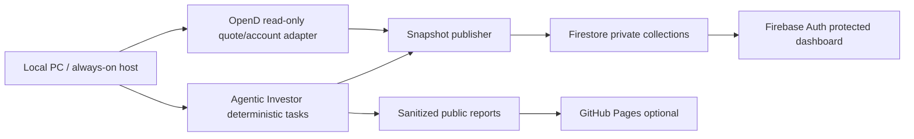

# Agentic Investor Realtime Dashboard Plan

## Goal

Build a private, realtime dashboard that shows:

- overall account state: NAV, cash, exposure, daily P&L, drawdown, open intents
- market state: QQQ/NVDA trend, macro regime, earnings blackout, source health
- key symbols: starter basket, watchlist, fund-manager overlap, congressional signals
- decision queue: staged intents, blocked items, event-risk reviews, manual confirmations

This dashboard is advisory-first. It must not unlock trading or place broker orders.

## Recommended Infra

Use Firebase Hosting or Firebase App Hosting plus Firebase Auth and Cloud Firestore.

GitHub Pages plus Firebase is technically possible for a static app, but GitHub Pages is best kept for public demos and non-private reports. Account snapshots and decision queues should live behind Firebase Auth and Firestore Security Rules.

### Why Firebase

- Firestore realtime listeners can update the UI as soon as a local/worker process writes a new snapshot.
- Firebase Auth and Firestore Security Rules can restrict reads to your UID.
- Firebase Hosting gives SSL/CDN/preview channels and keeps the dashboard and database in one security model.
- A local bridge can publish read-only moomoo/OpenD snapshots without exposing account credentials to the browser.

### Where GitHub Pages Still Fits

- public HTML pitch decks
- sanitized weekly review dashboards
- backtest demos without account snapshots
- public documentation

Do not publish live account data or account-derived JSON to GitHub Pages.

## Data Flow



## Runtime Options

### Option A: Firebase Hosting + Firestore + Local Bridge

Best first production path.

- frontend: Vite/React or dependency-light static app
- auth: Firebase Auth, one allowlisted user
- realtime data: Firestore `onSnapshot`
- publisher: local Python task writes account/market/decision snapshots
- hosting: Firebase Hosting

Pros: simple, realtime, cheap, strong enough security model.
Cons: if the local machine sleeps, moomoo/OpenD snapshots stop.

### Option B: Firebase App Hosting + Cloud Run Worker

Best if we move non-moomoo data to cloud.

- cloud worker handles public market/fund/earnings/congress sources
- local bridge only publishes moomoo-specific private account data
- dashboard still reads Firestore

Pros: public-data automation survives your laptop closing.
Cons: slightly more setup.

### Option C: Cloudflare Pages + Workers + D1/KV

Good alternative if we prefer Cloudflare.

Pros: excellent edge hosting, Workers Cron, lightweight APIs.
Cons: Firestore-style realtime and auth rules are less direct; more custom backend work.

### Option D: Supabase

Good if we want SQL and Postgres realtime.

Pros: Postgres, row-level security, SQL analytics.
Cons: more schema/admin overhead than Firebase for this first dashboard.

## Security Model

- Browser never talks to moomoo/OpenD.
- Browser never sees broker credentials, account IDs beyond masked labels, or service account keys.
- Firestore write access is service-only through local bridge or Cloud Function.
- Frontend users get read-only access to their own `/users/{uid}/...` documents.
- GitHub Pages receives only sanitized artifacts via allowlist.

Suggested Firestore shape:

```text
users/{uid}/snapshots/current
users/{uid}/market/current
users/{uid}/symbols/{symbol}
users/{uid}/decisions/{intentId}
users/{uid}/events/earnings_current
users/{uid}/committee/latest
users/{uid}/health/latest
```

## Dashboard Layout

### First Screen

Dense, calm command center. No hero, no marketing copy.

- top bar: timestamp, connection status, mode, execution lock
- left rail: Overview, Decisions, Positions, Market, Symbols, Events, Logs
- main grid:
  - Account: NAV, cash, gross exposure, daily P&L
  - Risk: health, macro regime, earnings blackout, drawdown
  - Decision Queue: staged intents and required actions
  - Market Pulse: QQQ/NVDA trend, strongest/weakest names

### Priority Order

1. Things that need a decision now
2. Things that can block trading
3. Account/risk state
4. Market and symbol context
5. Audit trail

## Visual Direction

References reviewed:

- Behance finance dashboard examples emphasize clear cards, dark/light fintech dashboards, and reduced visual noise.
- Godly.design is useful for modern app/site layout patterns and restrained interaction polish.
- Page Flows and Mobbin are better for user-flow realism: onboarding, dashboards, filters, alerts, and settings should feel like real software, not concept art.

Recommended style:

- light neutral surface, not one-note purple/blue
- compact cards with 6-8px radius
- tabular data for decisions and positions
- restrained accent colors: teal for healthy, amber for review, red for blocked
- no decorative orbs, no marketing hero, no large empty cards
- monospaced numbers for P&L, prices, weights

## MVP Scope

1. Private Firebase project and Auth allowlist
2. Firestore schema and security rules
3. Read-only publisher that writes current local snapshots:
   - state
   - health
   - research committee
   - staged intents
   - trading signals
   - earnings risk
   - congress signals
4. Dashboard frontend:
   - Overview
   - Decision Queue
   - Market/Symbols
   - Event Risk
   - Audit Log
5. GitHub Pages remains sanitized public report publishing only.

## Build Order

1. Build local mock dashboard with JSON files from `data/` and `reports/`.
2. Add Firebase client read path with Auth.
3. Add local publisher to Firestore.
4. Add Firestore Security Rules.
5. Move public data refresh to cloud if laptop uptime becomes a problem.

## Decision

Use Firebase Hosting + Auth + Firestore for the private realtime dashboard. Keep GitHub Pages for public/sanitized dashboards only.

## Current Implemented Status

- Frontend lives in `dashboard/`.
- Private snapshot is generated by `scripts/dashboard_snapshot.py`.
- Firestore publish is handled by `scripts/publish_dashboard_firestore.py`.
- Browser config lives in `dashboard/firebase-config.js`; it is public Firebase web config plus the allowed UID, not a service account key.
- Service account JSON must stay outside the repo and be referenced through `.env`.
- `intraday_monitor` now refreshes market data, paper portfolio mark-to-market, conditional playbook, paper fills, intel/social/event radar, order intents, dashboard snapshot, and Firestore publish in one pass.
- Dashboard includes account view, market pulse, watchlist coverage, social sentiment, event radar, decision queue, fund managers, congressional signals, and audit log.

For OpenClaw migration and first-run validation, follow `OPENCLAW_TRANSFER.zh.md`.
